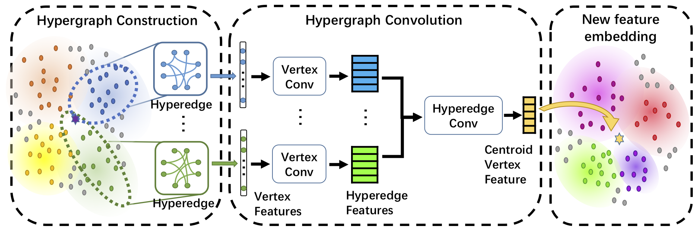

# DHGNN: Dynamic Hypergraph Neural Networks
Created by Jianwen Jiang, Yuxuan Wei, Yifan Feng, Jingxuan Cao and Yue Gao from Tsinghua University and Xiamen University.

## Introduction
This work has been published in IJCAI 2019.  
Dynamic Hypergraph Neural Networks (DHGNN) is a kind of neural networks modeling dynamically evolving hypergraph structures, which is composed of the stacked layers of two modules: dynamic hypergraph construction (DHG) and hypergrpah convolution (HGC). Considering initially constructed hypergraph is probably not a suitable representation for data, the DHG module dynamically updates hypergraph structure on each layer. Then hypergraph convolution is introduced to encode high-order data relations in a hypergraph structure. The HGC module includes two phases: vertex convolution and hyperedge convolution, which are designed to aggregate feature among vertices and hyperedges, respectively. We have evaluated our method on standard datasets, the Cora citation network and Microblog dataset. Detailed introduction can be found in [the original paper](https://www.ijcai.org/proceedings/2019/0366.pdf).  
In this repository, we release the code for train and test DHGNN on Cora citation dataset.
## Citation
```
@inproceedings{Jiang2019Dynamic,
  title={Dynamic Hypergraph Neural Networks},
  author={Jianwen Jiang, Yuxuan Wei, Yifan Feng, Jingxuan Cao and Yue Gao},
  booktitle={Proceedings of International Joint Conferences on Artificial Intelligence},
  page={2635-2641},
  year={2019}
}
```
## Installation
The code has been tested with Python 3.6, CUDA 9.0 on Ubuntu 16.04. GPU is needed to run the code. You may also need some of the following Python packages, which can be installed via pip or conda:
- absl-py (0.7.0)
- astor (0.7.1)
- backports.weakref (1.0rc1)
- bleach (1.5.0)
- certifi (2016.2.28)
- cycler (0.10.0)
- decorator (4.1.2)
- gast (0.2.2)
- grpcio (1.18.0)
- h5py (2.7.0)
- html5lib (0.9999999)
- Keras-Applications (1.0.6)
- Keras-Preprocessing (1.0.5)
- kiwisolver (1.0.1)
- Markdown (2.6.9)
- matplotlib (3.0.2)
- networkx (1.11)
- numpy (1.15.4)
- pandas (0.20.3)
- Pillow (5.3.0)
- pip (9.0.1)
- protobuf (3.6.1)
- pyparsing (2.3.1)
- python-dateutil (2.6.1)
- pytz (2017.2)
- PyYAML (3.13)
- scikit-learn (0.19.0)
- scipy (1.1.0)
- setuptools (36.4.0)
- six (1.11.0)
- tensorboard (1.12.2)
- tensorflow (1.3.0)
- tensorflow-gpu (1.12.0)
- tensorflow-tensorboard (0.1.5)
- termcolor (1.1.0)
- thop (0.0.31.post1909230639)
- torch (0.4.1)
- torchvision (0.2.1)
- Werkzeug (0.12.2)
- wheel (0.29.0)
## Usage
### Data Preparation
We use preprocessed Cora dataset for experiments, which is provided by [github repo of planetoid](https://github.com/kimiyoung/planetoid/tree/master/data) (Zhilin Yang, William W. Cohen, Ruslan Salakhutdinov, [Revisiting Semi-Supervised Learning with Graph Embeddings](https://arxiv.org/abs/1603.08861), ICML 2016). After downloading the Cora dataset, put it under path `$data_root/$citation_root`, where `$data_root` and `$citation_root` is configured in `config/config_cora.yaml`. Make sure to edit these two properties of configuration before running the code.  
When running on your own datasets, make sure to over-write `datasets/cora.py` for your own customized dataset interface. 
## Train and Test model
Train and test DHGNN model on Cora dataset by:
```shell
python train.py
```
The Python script `train.py` is set to run on the GPU-0. You can assign which GPU to use by modifying the 22nd line of `train.py`:
```python
os.environ['CUDA_VISIBLE_DEVICES'] = '0'    # edit this number to assign which GPU to run on
```
## License
Our code is released under MIT License (see LICENSE file for details).
